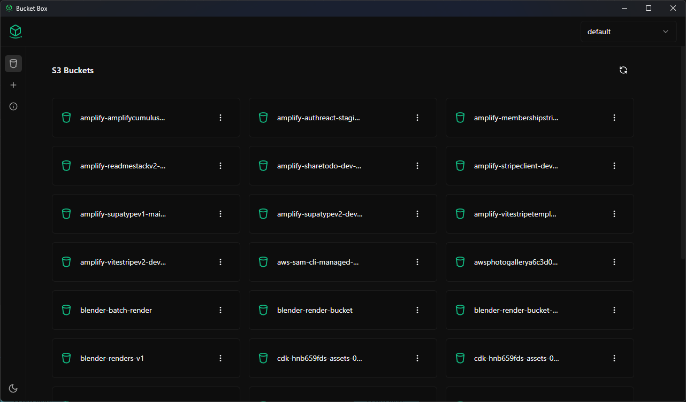
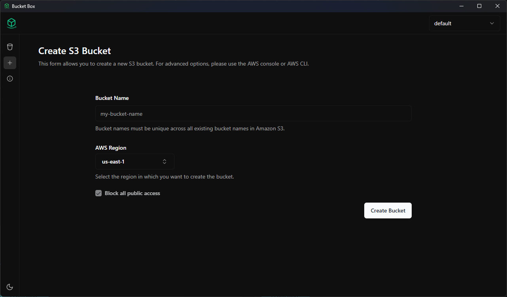
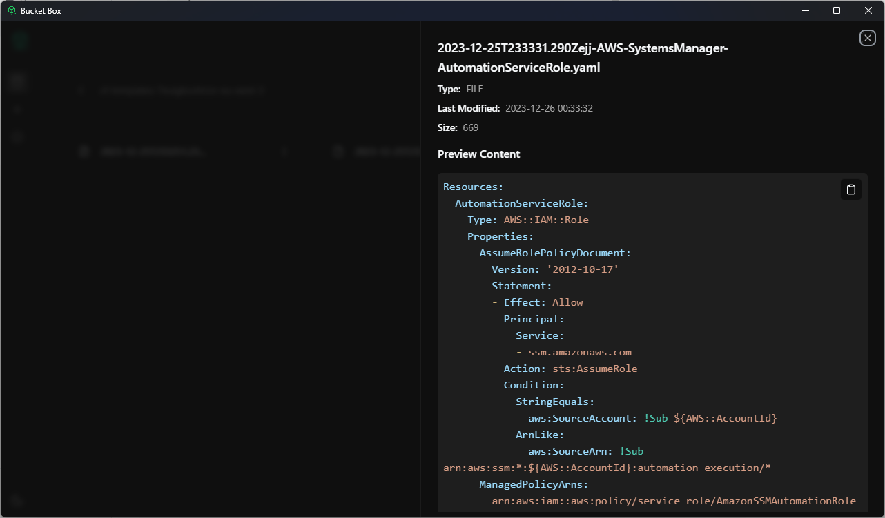
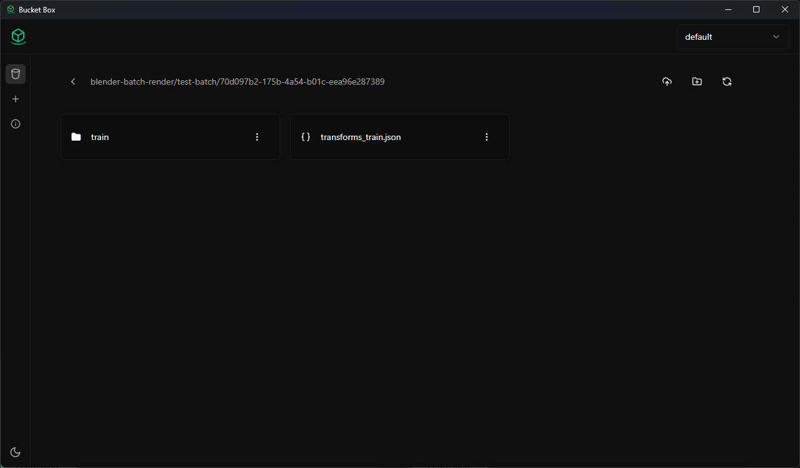

# Bucket Box

Bucket Box is a lightweight experimental desktop application designed for managing AWS S3 buckets. This project utilizes AWS CLI v2 to execute commands for interacting with AWS services. Please note that it has primarily been tested on Windows OS.

| Bucket List                              | New Bucket                             |
| ---------------------------------------- | -------------------------------------- |
|  |  |

| Object Detail                             | Contents                           |
| ----------------------------------------- | ---------------------------------- |
|  |  |

## Features

- **Bucket Management:** View all S3 buckets, create new buckets, and examine bucket policies and CORS rules.
- **File Operations:** Explore bucket contents, preview various file types (images, code files), upload, download, and delete files from buckets.
- **File Transfer:** Conveniently drag and drop files from your local machine to upload them directly to an S3 bucket.
- **Pre-signed URLs:** Generate pre-signed URLs for secure file access.

## Technology Stack

- **Frontend:** `React`, `TypeScript`, `React Query v5`, `Tailwind CSS`, `shadcn/ui`
- **AWS CLI v2:** For AWS interactions
- **Desktop App Framework:** `Tauri`

## Installation

You can download and install Bucket Box from the [Releases](https://github.com/jer-nc/bucket-box/releases) section of this repository.

### Prerequisites

- AWS CLI v2 installed and configured

## Usage

1. **Download:** Obtain the installer from the Releases page.
2. **Installation:** Follow installation instructions provided in the installer.
3. **AWS Configuration:** Ensure AWS CLI v2 is correctly configured with necessary permissions.
4. **Launch:** Open Bucket Box to start managing your S3 buckets.

## Acknowledgments

- Thanks to the contributors and developers of the libraries and frameworks used in this project.

## Resources

- [AWS CLI v2](https://docs.aws.amazon.com/cli/latest/userguide/install-cliv2.html)
- [Tauri](https://tauri.app/)
- [React Query](https://tanstack.com/query/latest/)
- [Tailwind CSS](https://tailwindcss.com/)
- [shadcn/ui](https://ui.shadcn.com/)